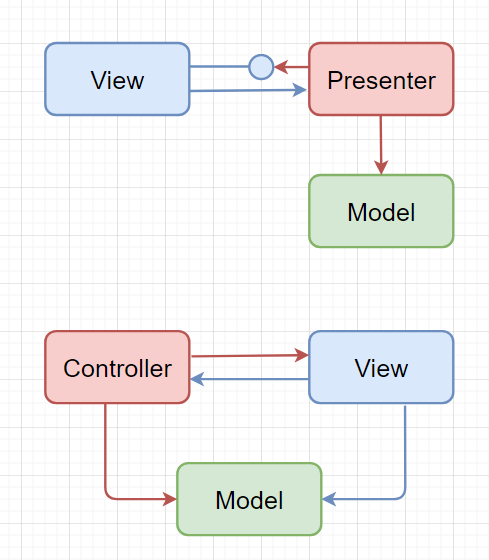

# GUI 架构

## Definition of *Software Architecture*

网上查阅资料，搜到了[这篇文档(Software Architecture Guide)](https://martinfowler.com/architecture/)，文档作者对软件架构说明了 3 个定义：

> - a better view of architecture was **the shared understanding that the expert developers have of the system design.**
> - “the design decisions that need to be made early in a project”, but Ralph complained about this too, saying that it was more like **the decisions you wish you could get right early in a project**.
> - His conclusion was that **“Architecture is about the important stuff. Whatever that is”**.

也就是说软件架构没有太明确的定义，有的人认为是专家对整个系统的设计，也有观点认为就是整个项目开始前这些设计理念的设计者认为的该有的“打开方式”，结论就是：不管是啥，就是跟重要的事情有关的东西。

我也就理解为 something important you should decide and design before the whole project, whatever comes to your mind. 

在文档下面有个关于 [GUI Architectures](https://martinfowler.com/eaaDev/uiArchs.html) 的链接，虽然说 2006 年的可能有点老，毕竟 User Interface 的设计和审美随时间会不断变换，但是这篇文章不讲美观，只讲架构，还是值得深入学习的。

## GUI Architectures

文章提到了几种不同的 UI 架构，最简单的先从表格入手。

### 表单/表格

#### 结构

> The form contains two main responsibilities:
>
> - Screen layout: defining the arrangement of the controls on the screen, together with their hierarchic structure with one other.
> - Form logic: behavior that cannot be easily programmed into the controls themselves.

表格包含2个部分：屏幕布局和表格逻辑。

#### 数据备份

而控件中显示了数据。然后讲到了 SQL 数据备份：

> In most situations there are three copies of the data involved:
>
> - One copy of data lies in the database itself. This copy is the lasting record of the data, so I call it the **record state**. The record state is usually shared and visible to multiple people via various mechanisms.
> - A further copy lies inside in-memory [Record Sets](https://martinfowler.com/eaaCatalog/recordSet.html) within the application. Most client-server environments provided tools which made this easy to do. This data was only relevant for one particular session between the application and the database, so I call it **session state**. Essentially this provides a temporary local version of the data that the user works on until they save, or commit it, back to the database - at which point it merges with the record state. I won't worry about the issues around coordinating record state and session state here: I did go into various techniques in [[P of EAA\]](https://martinfowler.com/books.html#eaa).
> - The final copy lies inside the GUI components themselves. This, strictly, is the data they see on the screen, hence I call it the **screen state**. It is important to the UI how screen state and session state are kept synchronized.

#### 数据绑定

然后提到了保持前端界面状态和同步更新，以此用到的工具就是 数据绑定([Data Binding](https://martinfowler.com/eaaDev/DataBinding.html))。就是说任何更新都应该立即同步。

然后就开始讲数据绑定的细节：

> In general data binding gets tricky because if you have to avoid cycles where a change to the control, changes the record set, which updates the control, which updates the record set.... The flow of usage helps avoid these - we load from the session state to the screen when the screen is opened, after that any changes to the screen state propagate back to the session state. It's unusual for the session state to be updated directly once the screen is up. As a result data binding might not be entirely bi-directional - just confined to initial upload and then propagating changes from the controls to the session state.

#### 客户端服务器工具包

表格的任一字段的改变都应该被提醒，然后就提到了 client-server toolkits 。读完之后就是在说 event listener。

#### Diagram

> 
>
> 
<i>Figure 2: Class diagram for forms and controls</i>

>
> The text field declares an event for text changed, when the form assembles the screen during initialization it subscribes itself to that event, binding it a method on itself - here `actual_textChanged`.
>
> 
>
> 
<i>Figure 3: Sequence diagram for changing a genre with forms and controls.</i>

>
> When the user changes the actual value, the text field control raises its event and through the magic of framework binding the `actual_textChanged` is run. This method gets the text from the actual and target text fields, does the subtraction, and puts the value into the variance field. It also figures out what color the value should be displayed with and adjusts the text color appropriately.

发生事件后的各种细节，图表显示更清晰。

#### 总结

> - Developers write application specific forms that use generic controls.
> - The form describes the layout of controls on it.
> - The form observes the controls and has handler methods to react to interesting events raised by the controls.
> - Simple data edits are handled through data binding.
> - Complex changes are done in the form's event handling methods.

### 模型视图控制器 Model View Controller (MVC)

经典MVC模式中，M是指业务模型，V是指用户界面，C则是控制器，使用MVC的目的是将M和V的实现代码分离，从而使同一个程序可以使用不同的表现形式。MVC的核心思想是分离演示。

V即View视图是指用户看到并与之交互的界面。比如由html元素组成的网页界面，或者软件的客户端界面。MVC的好处之一在于它能为应用程序处理很多不同的视图。在视图中其实没有真正的处理发生，它只是作为一种输出数据并允许用户操作的方式。

M即model模型是指模型表示业务规则。在MVC的三个部件中，模型拥有最多的处理任务。被模型返回的数据是中立的，模型与数据格式无关，这样一个模型能为多个视图提供数据，由于应用于模型的代码只需写一次就可以被多个视图重用，所以减少了代码的重复性。

C即controller控制器是指控制器接受用户的输入并调用模型和视图去完成用户的需求，控制器本身不输出任何东西和做任何处理。它只是接收请求并决定调用哪个模型构件去处理请求，然后再确定用哪个视图来显示返回的数据。

#### 分离演示

MVC 中最具有影响力的框架，分离演示 (Separated Presentation)，明确划分了模拟我们对真实世界感知的**域对象**(Domain Objects)和我们在屏幕上看到的 GUI 元素的**演示对象**(Presentation Objects)。

域对象也称之为模型(Model)对象，完全忽视 UI 。

> MVC的表示部分由  view（视图） 和 controller（控制器） 两个部分组成
>
> 
>
> 
<i>视图和控制器之间的基本依赖关系</i>

#### 流同步和观察者同步

> These two styles I describe as patterns: [Flow Synchronization](https://martinfowler.com/eaaDev/FlowSynchronization.html) and [Observer Synchronization](https://martinfowler.com/eaaDev/MediatedSynchronization.html). 
>
> 这两种模式描述了在屏幕状态和会话状态之间进行同步触发的替代方式。表单和控件通过应用程序流来操作需要直接更新的各种控件。MVC通过对模型进行更新，然后依靠观察者关系来更新观察模型的视图。
>
> These two patterns describe alternative ways of handlin the triggering of synchronization between screen state and session state. Forms and Controls do it through the flow of the application manipulating the various controls that need to be updated directly. MVC does it by making updates on the model and then relying of the observer relationship to update the views that are observing that model.

#### 总结

> - Make a strong separation between presentation (view & controller) and domain (model) - [Separated Presentation](https://martinfowler.com/eaaDev/SeparatedPresentation.html).
> - 将视图与控制器和模型分开。
> - Divide GUI widgets into a controller (for reacting to user stimulus) and view (for displaying the state of the model). Controller and view should (mostly) not communicate directly but through the model.
> - 将用户图形交互组件拆分成为单一的控制器和视图。其中，控制器和视图只应通过模型来通信。
> - Have views (and controllers) observe the model to allow multiple widgets to update without needed to communicate directly - [Observer Synchronization](https://martinfowler.com/eaaDev/MediatedSynchronization.html).
> - 运行视图和控制器观测模型，从而使得组件更新无需直接通信。

### 视觉工作的应用模型 VisualWorks Application Model

VisualWorks 提出了一种应用模型的结构，一种类似于演示模型的结构，以此解决 MVC 难以应对视图逻辑和视图状态的难题。

解决问题的关键是把属性转变成对象。对于通常的带有属性的对象，我们可能会认为它有名字和地址等属性。当我们访问该对象的某属性时，如果不使用将属性看作对象的思想，我们需要使用类似obj.property的写法来获得值。若将属性变成对象，那我们可以通过属性返回一个封装实际值的对象，然后通过这个对象获取实际值。这种方法使得部件和模型间的映射变得更为简单。我们只需要告诉部件发送什么样的信息来获取相应属性，部件通过访问获得的对象来获取正确的值。使用应用模型和经典 MVC 的主要区别在于，我们现在在业务对象类和部件之间有一个中间类 : 应用模型类。小部件不会直接访问业务对象。

> 
>
> 
<i>Figure 9: Class diagram for visual works application model on the running example</i>

应用模型的特点如下：

和传统MVC一样使用展示分离和观察同步的方法

引入中间应用模型作为展示逻辑和状态的载体（展示模型的缩减版）

部件不直接访问业务对象模型，它们通过应用模型来间接访问。

使用属性对象连接不同层，并使用观察器支持粒度同步

### 模型视图演示者 Model-View-Presenter (MVP)

MVP是一种架构，最早出现在IBM中，在1990年代的Taligent中更明显。最早通过Potel论文提及，这个想法被Dolphin Smalltalk的开发者进一步推广和描述。正如我们将看到的，这两种描述并不完全是相互联系的，但其基本思想已变得很流行。

在MVP模式中，Model负责实现业务逻辑，保存数据，状态信息，Model仅仅向Presenter提供一组服务接口，隐藏了内部实现的细节；View负责与用户交互，它接收用户的操作、输入信息，与Presenter交互获得数据，展示给用户；Presenter是View和Model的中间层，它接收来自View的输入，并将其传递给Model，然后依据处理结果更新View。下图演示了Model，View，Presenter三者的交互逻辑。

> 

对比 MVP 和 MVC：

> - 两者之间主要的区别是其实现方式和偶尔有些情况下需要同时使用Presenter和Controller。
> - 在MVP模式中，View和Model之间是松耦合的，Presenter负责将Model绑定到View。通常情况下，View和Presenter是一对一的关系，复杂的View可能有多个Presenter。
> - 在MPC模式中，Controller是基于操作的，能够在View之间共享。Controller负责决定显示哪个View。

#### 总结

> - 在MVP模式中，接口里声明的事件和控件都是要在Presenter里要处理窗体中的信息。重要的是窗体必须实现IView接口并且必须New一个P，把自身作为参数传到P里，这样在P里就可以利用多态访问窗体的成员了。并且重点是在窗体里我们可以利用委托或其他技术，把对用户输入输出、事件的响应，全部放到P里处理。因为P不知道窗体，只知道IView，所以我们可以建立多个不同的窗体来对应一个P了，只要他们的业务逻辑、事件处理相同即可。
> - 如果能够很好的利用MVP来编程，则窗体将变得非常简单,甚至可以让毫无经验的编码人员来负责窗体的UI设计等，十分方便。

### 简易视图（Humble View）

​		当人们谈论自测试代码时，用户界面很是一个比较突出的问题。许多人发现测试GUI介于艰难和不可能之间。这在很大程度上是因为UI紧密耦合到整个UI环境中，很难将UI分解并进行分段测试。

​		通过创建小部件并在测试代码中进行操作，可以取得不错的结果，但是在某些情况下，这是不可能实现的，可能会错过重要的交互，存在线程问题，测试运行的速度也会变慢。

​		因此，在设计UI的过程中，已经有了一个稳定的过程，使测试时遇到的对象中的行为最小化。迈克尔-弗斯在[The Humble Dialog Box] 将这一概念推广到**简易对象**-任何难以测试的物体都应有最低限度的行为。这样，如果我们不能将它包含在测试套件中，我们就尽量减少未被检测到的失败的可能性。

​		演示者不仅决定如何对用户事件作出反应，而且还处理UI小部件本身中的数据填充。因此，小部件不再具有模型的可见性，也不再需要可见性；它们形成一个[被动视点]被当前用户操纵。另一种方法是使用[表示模型]，尽管在小部件中确实需要更多的行为，但足够让小部件知道如何将自己映射到[表示模型]。这两种方法的关键是，通过测试演示者或测试演示模型，可以测试UI的大部分风险，而不必接触到难以测试的小部件。

> [The Humble Dialog Box](http://www.objectmentor.com/resources/articles/TheHumbleDialogBox.pdf) paper uses a presenter, but in a much deeper way than the original MVP. Not just does the presenter decide how to react to user events, it also handles the population of data in the UI widgets themselves. As a result the widgets no longer have, nor need, visibility to the model; they form a [Passive View](https://martinfowler.com/eaaDev/PassiveScreen.html), manipulated by the presenter.
>
> This isn't the only way to make the UI humble. Another approach is to use [Presentation Model](https://martinfowler.com/eaaDev/PresentationModel.html), although then you do need a bit more behavior in the widgets, enough for the widgets to know how to map themselves to the [Presentation Model](https://martinfowler.com/eaaDev/PresentationModel.html).

​		带着表示模型通过让所有的实际决策都由表示模型。所有用户事件和显示逻辑被路由到表示模型，所以小部件所要做的就是将自己映射到表示模型。然后，可以测试表示模型没有任何小部件存在-唯一的风险在于小部件映射。只要这很简单，就能不去测试它。在这种情况下，屏幕并不像被动视点接近，但差别很小。

​		自被动视点使小部件变得比较单一，甚至没有映射，被动视点消除即使是小的风险表示模型。然而，代价是需要在测试运行过程中模拟屏幕--这是需要构建的额外机器。