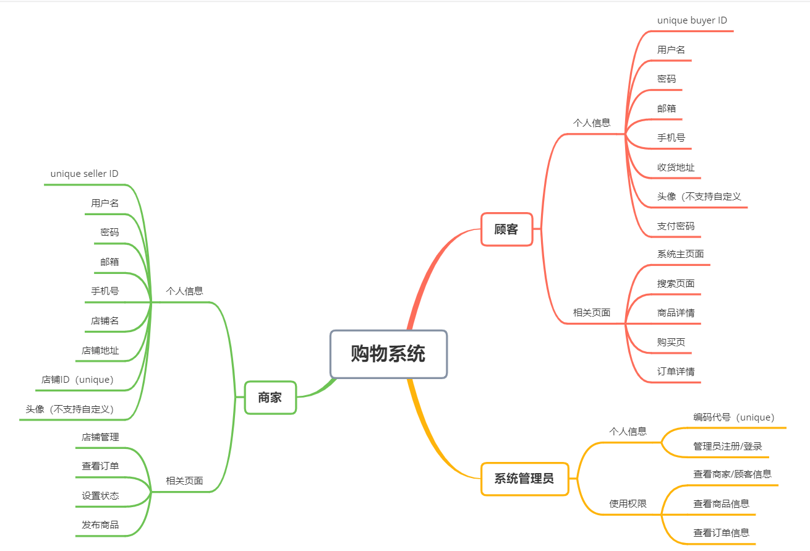

GB8567——88

****可行性研究报告****

# ****1引言****

## ***1.1编写目的***

本研究报告的目的是为了制定购物系统开发过程的可行性计划，明确所要开发的软件具有的功能、性能、环境以及限制性因素，同时及时更新开发过程和解决办法，提高工作效率，减少不必要的时间和精力浪费，避免盲目开发导致不必要的困难，使开发过程更具有便捷，可靠的特点。

本系统的目的是了解网上购物系统的工作流程，掌握当下淘宝，京东等电子商务平台的服务状态和和方式，同时学习互联网营销的手段，将虚拟和现实结合起来，运用信息化管理方式完成一系列的网上购物流程，也是作为入门软件工程开发的第一步，提高团队协作的开发能力。

## ****1.2背景****

​		当下电子商务平台的不断发展，越来越多的人对于网上购物，直播带货等多种多样的买卖方式产生了兴趣，同时各类购物平台不断开发升级自己的购物系统，发展出个人或者企业独立的网上门店，各种各样的平台样式不断出现，但是归结到核心内容底层的开发还是比较相似的。因此本团队致力于打造自己的购物平台，深度了解购物平台底层的建设。

## ****1.3定义****

后端：Python Django RESTful架构 Nginx MySQL Redis

前端：vs code

文档：Typora

## ****1.4参考资料****

《软件工程》（第四版）【美】Shari Lawrence Pfleeger  【加】Joanne M.Atlee  著  杨卫东 译  人民邮电出版社

# ****2可行性研究的前提****

该开发项目是在如今电商平台已经日臻成熟的背景下进行的一次模拟，通过购物平台的开发过程，实现对主流购物系统的运行机制有一定的理解。项目的主要目标是实现商家顾客的基本操作，由于技术方面和实验具体要求的原因，对于评论和购物车功能就不予开发了。

## ****2.1要求****

A. 功能：实现购物系统的基本功能

1. 产品类别维护：管理员可以维护产品类别，每个类别下面可能继续划分为若干子类。

2. 用户注册：网民注册，注册后的网民立刻可以在该系统中购买商品，但是如果该用户想成为商家销售商品，还需要提出特殊申请，由管理员批准；

3. 商品发布：每个审批后的商家可以发布自己的商品，包括商品名称、类别、上传图片、价格等等；

4. 商品购买：网民发现自己满意的商品后，可以立刻下订单，购买(不必考虑支付、购物车以及邮费问题)；

5. 商品发货：商家在后台看到网民的订单后，进行发货，将订单状态设置为已经发货；

6. 收货确认：网民收到商品后，确认自己的订单，将订单状态设置为已经收货；

7. 系统可以统计某个时间段内，所有商品销售金额，各类别商品的销售金额，各商家的销售金额

B. 性能：用户和商家根据页面提示完成一系列操作过程，同时优化商品页详情和预览，以及商品搜索页按价格排序等，提高系统服务质量。

C. 输出

点击弹出注册/登陆界面；

搜索及商品详情展示页面；

订单页面；

导出销售信息；

统计销售额；

D. 输入

顾客/商家的注册/登录信息；

内置商品的详情数据；

登录时的验证信息；

要搜索的商品详情；

要查找的订单；

E. 在安全与保密方面的要求：顾客全部信息只有顾客和管理员可见，商家可见部分顾客信息；商家信息只有商家和管理员可见，顾客可见部分商家信息。

F. 同本系统相连接的其他系统：无

G. 完成期限：五十天

## ****2.2目标****

​		方便了解主流购物平台的运行工作机理，学习软件开发索要掌握的基本要求，发现现有平台的不足，提出有效的可行性建议，掌握互联网营销手段，了解海量数据下的调度问题，将本购物系统实现基本的运行，增强系统的现实作用。同时也是加强团队协作开发的练兵，提高小组的效率。

## ****2.3条件、假定和限制****

a． 所建议系统的运行寿命的最小值：三年

b． 经费、投资方面的来源和限制：自行解决，基本无特殊限制

c． 法律和政策方面的限制：完全遵从现有法律

d． 硬件：笔记本

e.     软件：windows10

f.     运行环境：vs code，pycharm

g． 可利用的信息和资源：京东淘宝等平台

h． 系统投入使用的最晚时间：2021年6月

## ****2.4进行可行性研究的方法****

本次可行性研究主要通过调查研究法，通过小组会议和网上调查研究，在基本清楚了购物系统的运行框架之后才指定要开发的具体计划，以减少不必要的人力、物力损失。

## ****2.5评价尺度****

1、开发费用：0元

2、各项功能的优先次序：满足操作人员，管理人员以及一般用的基本使用

3、开发时间：50天

4、难易程度：适合能够上网的大众人群

# ****3对现有系统的分析****

这里的现有系统是指当前实际使用的系统，这个系统可能是计算机系统，也可能是一个机械系统甚 至是一个人工系统。

分析现有系统的目的是为了进一步阐明建议中的开发新系统或修改现有系统的必要性。

## ****3.1处理流程和数据流程****

## ****3.2工作负荷****

能够支持500人同时在线使用系统，对于商家和店铺的开设能在百户左右。

## ****3.3费用开支****

本项目主要是人力的开支，基本上每周每个人满足五个小时以上的工作量。

## ****3.4人员****

软件工程师三名，操作员及团队计划制定两名

## ****3.5设备**** 

五台笔记本

## ****3.6局限性****

​		现有系统界面风格处理时间过慢，用户等待时间过长，大大影响了效率，由于处理功能的不完善，很多服务无法实现，有的需求甚至自己输出，即增加了负担又浪费了时间，用户身份不明确，造成对数据的存储和操作混乱。

# ****4所建议的系统****

本章将用来说明所建议系统的目标和要求将如何被满足。

## ****4.1对所建议系统的说明****

概括地说明所建议系统，并说明在第2章中列出的那些要求将如何得到满足，说明所使用的基本方法及理论根据。

## ****4.2处理流程和数据流程****

给出所建议系统的处理流程和数据流程。

## ****4.3改进之处****

按2.2条中列出的目标，逐项说明所建议系统相对于现存系统具有的改进。

## ****4.4影响****

说明在建立所建议系统时，预期将带来的影响，包括：

### ****4.4.1对设备的影响****

说明新提出的设备要求及对现存系统中尚可使用的设备须作出的修改。

### ****4.4.2对软件的影响****

说明为了使现存的应用软件和支持软件能够同所建议系统相适应。而需要对这些软件所进行的修改和补充。

### ****4.4.3对用户单位机构的影响****

说明为了建立和运行所建议系统，对用户单位机构、人员的数量和技术水平等方面的全部要求。

### ****4.4.4对系统运行过程的影响****

说明所建议系统对运行过程的影响，如：

a． 用户的操作规程；

b． 运行中心的操作规程；

c． 运行中心与用户之间的关系；

d． 源数据的处理；

e． 数据进入系统的过程；

f． 对数据保存的要求，对数据存储、恢复的处理；

g． 输出报告的处理过程、存储媒体和调度方法；

h． 系统失效的后果及恢复的处理办法。

### ****4.4.5对开发的影响****

说明对开发的影响，如：

a. 为了支持所建议系统的开发，用户需进行的工作；

b. 为了建立一个数据库所要求的数据资源；

c. 为了开发和测验所建议系统而需要的计算机资源；

d. 所涉及的保密与安全问题。

### ****4.4.6对地点和设施的影响****

说明对建筑物改造的要求及对环境设施的要求。

### ****4.4.7对经费开支的影响****

扼要说明为了所建议系统的开发，设计和维持运行而需要的各项经费开支。

## ****4.5局限性**** 

说明所建议系统尚存在的局限性以及这些问题未能消除的原因。

## ****4.6技术条件方面的可行性****

本节应说明技术条件方面的可行性，如：

a． 在当前的限制条件下，该系统的功能目标能否达到；

b． 利用现有的技术，该系统的功能能否实现；

c． 对开发人员的数量和质量的要求并说明这些要求能否满足；

d． 在规定的期限内，本系统的开发能否完成。

# ****5可选择的其他系统方案****

扼要说明曾考虑过的每一种可选择的系统方案，包括需开发的和可从国内国外直接购买的，如果没有供选择的系统方案可考虑，则说明这一点。

## ****5.1可选择的系统方案1****

参照第4章的提纲，说明可选择的系统方案1，并说明它未被选中的理由。

## ****5.2可选择的系统方案2****

按类似5.1条的方式说明第2个乃至第n个可选择的系统方案。

......

# ****6投资及效益分析****

##  ****6.1支出****

对于所选择的方案，说明所需的费用。如果已有一个现存系统，则包括该系统继续运行期间所需的费用。

### ****6.1.1基本建设投资****

包括采购、开发和安装下列各项所需的费用，如：

a. 房屋和设施；

b. ADP设备；

c. 数据通讯设备；

d. 环境保护设备；

e. 安全与保密设备；

f. ADP操作系统的和应用的软件；

g. 数据库管理软件。

### ****6.1.2其他一次性支出****

包括下列各项所需的费用，如：

a． 研究（需求的研究和设计的研究）；

b． 开发计划与测量基准的研究；

c． 数据库的建立；

d． ADP软件的转换；

e． 检查费用和技术管理性费用；

f． 培训费、旅差费以及开发安装人员所需要的一次性支出；

g． 人员的退休及调动费用等。

### ****6.1.3非一次性支出****

列出在该系统生命期内按月或按季或按年支出的用于运行和维护的费用，包括：

a． 设备的租金和维护费用；

b． 软件的租金和维护费用；

c． 数据通讯方面的租金和维护费用；

d． 人员的工资、奖金；

e． 房屋、空间的使用开支；

f． 公用设施方面的开支；

g． 保密安全方面的开支；

h． 其他经常性的支出等。

## ****6.2收益****

对于所选择的方案，说明能够带来的收益，这里所说的收益，表现为开支费用的减少或避免、差错的减少、灵活性的增加、动作速度的提高和管理计划方面的改进等，包括；

### ****6.2.1一次性收益****

说明能够用人民币数目表示的一次性收益，可按数据处理、用户、管理和支持等项分类叙述，如：

a． 开支的缩减包括改进了的系统的运行所引起的开支缩减，如资源要求的减少，运行效率的改进，数据进入、存贮和恢复技术的改进，系统性能的可监控，软件的转换和优化，数据压缩技术的采用，处理的集中化／分布化等；

b． 价值的增升包括由于一个应用系统的使用价值的增升所引起的收益，如资源利用的改进，管理和运行效率的改进以及出错率的减少等；

c． 其他如从多余设备出售回收的收入等。

### ****6.2.2非一次性收益****

说明在整个系统生命期内由于运行所建议系统而导致的按月的、按年的能用人民币数目表示的收益，包括开支的减少和避免。

### ****6.2.3不可定量的收益****

逐项列出无法直接用人民币表示的收益，如服务的改进，由操作失误引起的风险的减少，信息掌握情况的改进，组织机构给外界形象的改善等。有些不可捉摸的收益只能大概估计或进行极值估计（按最好和最差情况估计）。

## ****6.3收益／投资比****

求出整个系统生命期的收益／投资比值。

## ****6.4投资回收周期****

求出收益的累计数开始超过支出的累计数的时间。

## ****6.5敏感性分析****

所谓敏感性分析是指一些关键性因素如系统生命期长度、系统的工作负荷量、工作负荷的类型与这些不同类型之间的合理搭配、处理速度要求、设备和软件的配置等变化时，对开支和收益的影响最灵敏的范围的估计。在敏感性分析的基础上做出的选择当然会比单一选择的结果要好一些。

# ****7社会因素方面的可行性****

本章用来说明对社会因素方面的可行性分析的结果，包括：

## ****7.1法律方面的可行性****

法律方面的可行性问题很多，如合同责任、侵犯专利权、侵犯版权等方面的陷井，软件人员通常是不熟悉的，有可能陷入，务必要注意研究。

## ****7.2使用方面的可行性****

例如从用户单位的行政管理、工作制度等方面来看，是否能够使用该软件系统；从用户单位的工作人员的素质来看，是否能满足使用该软件系统的要求等等，都是要考虑的。

# ****8结论****

在进行可行性研究报告的编制时，必须有一个研究的结论。结论可以是：

a． 可以立即开始进行；

b． 需要推迟到某些条件（例如资金、人力、设备等）落实之后才能开始进行；

c． 需要对开发目标进行某些修改之后才能开始进行；

d． 不能进行或不必进行（例如因技术不成熟、经济上不合算等）。 