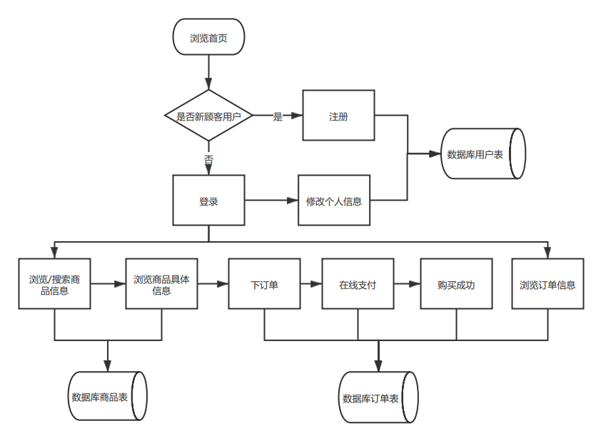
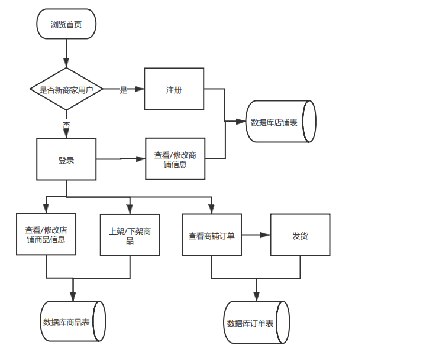

GB8567——88

****可行性研究报告****

# ****1引言****

## ***1.1编写目的***

本研究报告的目的是为了制定购物系统开发过程的可行性计划，明确所要开发的软件具有的功能、性能、环境以及限制性因素，同时及时更新开发过程和解决办法，提高工作效率，减少不必要的时间和精力浪费，避免盲目开发导致不必要的困难，使开发过程更具有便捷，可靠的特点。

本系统的目的是了解网上购物系统的工作流程，掌握当下淘宝，京东等电子商务平台的服务状态和和方式，同时学习互联网营销的手段，将虚拟和现实结合起来，运用信息化管理方式完成一系列的网上购物流程，也是作为入门软件工程开发的第一步，提高团队协作的开发能力。

## ****1.2背景****

​		当下电子商务平台的不断发展，越来越多的人对于网上购物，直播带货等多种多样的买卖方式产生了兴趣，同时各类购物平台不断开发升级自己的购物系统，发展出个人或者企业独立的网上门店，各种各样的平台样式不断出现，但是归结到核心内容底层的开发还是比较相似的。因此本团队致力于打造自己的购物平台，深度了解购物平台底层的建设。

## ****1.3定义****

后端：Python Django RESTful架构 Nginx MySQL Redis

前端：vs code

文档：Typora

## ****1.4参考资料****

《软件工程》（第四版）【美】Shari Lawrence Pfleeger  【加】Joanne M.Atlee  著  杨卫东 译  人民邮电出版社

# ****2可行性研究的前提****

该开发项目是在如今电商平台已经日臻成熟的背景下进行的一次模拟，通过购物平台的开发过程，实现对主流购物系统的运行机制有一定的理解。项目的主要目标是实现商家顾客的基本操作，由于技术方面和实验具体要求的原因，对于评论和购物车功能就不予开发了。

## ****2.1要求****

A. 功能：实现购物系统的基本功能

1. 产品类别维护：管理员可以维护产品类别，每个类别下面可能继续划分为若干子类。
2. 用户注册：网民注册，注册后的网民立刻可以在该系统中购买商品，但是如果该用户想成为商家销售商品，还需要提出特殊申请，由管理员批准；
3. 商品发布：每个审批后的商家可以发布自己的商品，包括商品名称、类别、上传图片、价格等等；
4. 商品购买：网民发现自己满意的商品后，可以立刻下订单，购买(不必考虑支付、购物车以及邮费问题)；
5. 商品发货：商家在后台看到网民的订单后，进行发货，将订单状态设置为已经发货；
6. 收货确认：网民收到商品后，确认自己的订单，将订单状态设置为已经收货；

7. 系统可以统计某个时间段内，所有商品销售金额，各类别商品的销售金额，各商家的销售金额

B. 性能：用户和商家根据页面提示完成一系列操作过程，同时优化商品页详情和预览，以及商品搜索页按价格排序等，提高系统服务质量。

C. 输出

点击弹出注册/登陆界面；

搜索及商品详情展示页面；

订单页面；

导出销售信息；

统计销售额；

D. 输入

顾客/商家的注册/登录信息；

内置商品的详情数据；

登录时的验证信息；

要搜索的商品详情；

要查找的订单；

E. 在安全与保密方面的要求：顾客全部信息只有顾客和管理员可见，商家可见部分顾客信息；商家信息只有商家和管理员可见，顾客可见部分商家信息。

F. 同本系统相连接的其他系统：无

G. 完成期限：五十天

## ****2.2目标****

​		方便了解主流购物平台的运行工作机理，学习软件开发索要掌握的基本要求，发现现有平台的不足，提出有效的可行性建议，掌握互联网营销手段，了解海量数据下的调度问题，将本购物系统实现基本的运行，增强系统的现实作用。同时也是加强团队协作开发的练兵，提高小组的效率。

## ****2.3条件、假定和限制****

a． 所建议系统的运行寿命的最小值：三年

b． 经费、投资方面的来源和限制：自行解决，基本无特殊限制

c． 法律和政策方面的限制：完全遵从现有法律

d． 硬件：笔记本

e.     软件：windows10

f.     运行环境：vs code，pycharm

g． 可利用的信息和资源：京东淘宝等平台

h． 系统投入使用的最晚时间：2021年6月

## ****2.4进行可行性研究的方法****

本次可行性研究主要通过调查研究法，通过小组会议和网上调查研究，在基本清楚了购物系统的运行框架之后才指定要开发的具体计划，以减少不必要的人力、物力损失。

## ****2.5评价尺度****

1、开发费用：0元

2、各项功能的优先次序：满足操作人员，管理人员以及一般用的基本使用

3、开发时间：50天

4、难易程度：适合能够上网的大众人群

# ****3对现有系统的分析****

这里的现有系统是指当前实际使用的系统，这个系统可能是计算机系统，也可能是一个机械系统甚 至是一个人工系统。

分析现有系统的目的是为了进一步阐明建议中的开发新系统或修改现有系统的必要性。

## 3.1处理流程和数据流程

## 顾客用户：

## 商铺用户：

## ****3.2工作负荷****

能够支持500人同时在线使用系统，对于商家和店铺的开设能在百户左右。

## ****3.3费用开支****

本项目主要是人力的开支，基本上每周每个人满足五个小时以上的工作量。

## ****3.4人员****

软件工程师三名，操作员及团队计划制定两名

## ****3.5设备**** 

五台笔记本

## ****3.6局限性****

​		现有系统界面排版风格受限于小组内的美工水平，无法创造十分优秀的视觉效果。可能会出现处理时间过慢的情况，影响用户的体验，降低了本系统的普及。同时局限于时间安排，无法实现更多更优质的服务功能。

# ****4所建议的系统****

本章将用来说明所建议系统的目标和要求将如何被满足。

## ****4.1对所建议系统的说明****

概括地说明所建议系统，并说明在第2章中列出的那些要求将如何得到满足，说明所使用的基本方法及理论根据。

## ****4.2处理流程和数据流程****

商家：注册/登录、开设店铺、增删商品、查看订单

顾客：注册/登录、查询商品、生成订单

管理员：管理顾客、商家、商品、订单等信息

## ****4.3改进之处****

1、对店铺信息的管理，需要设置商家开设店铺的基本要求和数量阈值；

2、管理顾客订单信息的修改次数；

3、控制管理员对商家和顾客信息的管理权限

## ****4.4影响****

说明在建立所建议系统时，预期将带来的影响，包括：

### ****4.4.1对设备的影响****

当使用的设备都可以运行，局限性不大。

### ****4.4.2对软件的影响****

购物系统建立在Windows10系统中，要求操作系统的版本是win7级以上，否则无法运行本购物系统。

### ****4.4.3对用户单位机构的影响****

​		极大的便利了相关用户单位的购物和开设店铺的需求，同时要求店家要经过培训才能在平台上开设店铺，以保证店铺的正常运行。

### ****4.4.4对系统运行过程的影响****

a． 用户的操作规程：根据主页的指导即可；

b． 运行中心的操作规程：在不影响系统当前运行的情况下对系统进行维护；

c． 运行中心与用户之间的关系：除用户的私密信息外运行中心可以获取用户全部信息，以保证用户实时的合法性和可行性；

d． 源数据的处理：

e． 数据进入系统的过程：

f． 对数据保存的要求，对数据存储、恢复的处理：

g． 输出报告的处理过程、存储媒体和调度方法：

h． 系统失效的后果及恢复的处理办法：

### ****4.4.5对开发的影响****

a. 为了支持所建议系统的开发，用户需进行的工作：熟悉前后端的开发和对接

b. 为了建立一个数据库所要求的数据资源；

c. 为了开发和测验所建议系统而需要的计算机资源：系统打包，能够异地发布，完成在多台电脑上进行测试工作

d. 所涉及的保密与安全问题：平台对用户的个人信息严格保密，对每个权限做到准确无误；

### ****4.4.6对地点和设施的影响****

基本无此方面要求

## ****4.5局限性**** 

开发小组是第一次做正规开发，实战经验不足，可能项目在运行过程中会出现一定的纰漏，考虑问题会片面化，同时协作开发平台GitHub的不稳定性会使小组成员在会议前没有及时收到更新信息。

## ****4.6技术条件方面的可行性****

1、开发系统后端采用Python Django RESTful架构 Nginx MySQL Redis，前端使用HTML开发；

2、小组成员部分有实验室的经验，前端也在数据库和可视化课程中学习过，有一定扎实的基础；

# ****5可选择的其他系统方案****

暂无

# ****6投资及效益分析****

##  ****6.1支出****
### ****6.1.1基本建设投资****

包括采购、开发和安装下列各项所需的费用，如：

a. 华为云服务器 1000元

b. 华为云数据库 500元

### ****6.1.2其他一次性支出****

暂无

### ****6.1.3非一次性支出****

列出在该系统生命期内按月或按季或按年支出的用于运行和维护的费用，包括：

a.华为云服务器 60元每月

b.华为云数据库 90元每月

## ****6.2收益****

对于所选择的方案，说明能够带来的收益，这里所说的收益，表现为开支费用的减少或避免、差错的减少、灵活性的增加、动作速度的提高和管理计划方面的改进等，包括；

### ****6.2.1一次性收益****

说明能够用人民币数目表示的一次性收益，可按数据处理、用户、管理和支持等项分类叙述，如：

a．商家入驻的平台费 1000元

### ****6.2.2非一次性收益****

a. 商家每年需提交利润的3%作为商铺维护费

### ****6.2.3不可定量的收益****

a. 商家推广的推广费

# ****7社会因素方面的可行性****

本系统是一个电子购物商务网站，市场已经成熟，各大类似电商平台接受度广，绝大多数社会民众对此较为熟悉。

## ****7.1法律方面的可行性****

  根据《中华人民共和国计算机软件保护条例》（1991年6月4日中华人民共和国国务院令第84号发布） （修改后的新条例2002年1月1日起施行）第九条可知：软件著作权人享有下列各项权利: 

  (一)发表权， 即决定软件是否公之于众的权利;

 (二)开发者身份权， 即表明开发者身份的权利以及在其软件上署名的权利;

 (三)使用权， 即在不损害社会公共利益的前提下， 以复制、展示、发行、修改、翻译、注释等方式使用其软件的权利;

 (四)使用许可权和获得报酬权， 即许可他人以本条第(三)项中规定的部分或者全部方式使用其软件的权利和由此而获得报酬的权利;

(五)转让权， 即向他人转让由本条第(三)项和第(四)项规定的使用权和使用许可权的权利。

 第十二条  受他人委托开发的软件， 其著作权的归属由委托者与受委托者签订书面协议约定， 如无书面协议或者在协议中未作明确约定， 其著作权属于受委托者。

 第十八条  在软件著作权的保护期内， 软件的著作权人或者其受让者有权许可他人行使本条例第九条第(三)项规定的使用权。著作权人或者其受让者许可他人行使使用权时， 可以按协议收取费用。

  另外，软件权利的使用许可应当根据我国有关法规以签订、执行书面合同的方式进行。被许可人应当在合同规定的方式、条件、范围和时间内行使使用权。合同中未明确规定为独占许可的， 被许可的软件权利应当视为非独占的。

  第二十二条  因课堂教学、科学研究、国家机关执行公务等非商业性目的的需要对软件进行少量的复制， 可以不经软件著作权人或者其合法受让者的同意， 不向其支付报酬。但使用时应当说明该软件的名称、开发者， 并且不得侵犯著作权人或者其合法受让者依本条例所享有的其他各项权利。该复制品使用完毕后应当妥善保管、收回或者销毁， 不得用于其他目的或者向他人提供。

 第三十条  除本条例第二十一条及第二十二条规定的情况外， 有下列侵权利为的， 应当根据情况， 承担停止侵害、消除影响、公开赔礼道歉、赔偿损失等民事责任， 并可以由国家软件著作权行政管理部门给予没收非法所得、罚款等行政处罚:

 (一)未经软件著作权人同意发表其软件作品;

 (二)将他人开发的软件当作自己的作品发表;

 (三)未经合作者同意， 将与他人合作开发的软件当作自己单独完成的作品发表;

 (四)在他人开发的软件上署名或者涂改他人开发的软件上的署名;

 (五)未经软件著作权人或者其合法受让者的同意修改、翻译、注释其软件作品;

 (六)未经软件著作权人或者其合法受让者的同意复制或者部分复制其软件作品;

 (七)未经软件著作权人或者其合法受让者的同意向公众发行、展示其软件的复制品;

 (八)未经软件著作权人或者其合法受让者的同意向任何第三方办理其软件的许可使用或者转让事宜。

第三十三条  当事人不履行合同义务或者履行合法义务不符合约定条件的，应当依照民法通则有关规定承担民事责任。

## ****7.2使用方面的可行性****

  本系统是一个电子购物商务网站，操作简易，指示明确，和流行的电子商务平台如淘宝并不巨大不同，用户购物以及商家运营商铺不需要了解背后的运行机制，只需按照提示操作即可。

# ****8结论****

  本项目所需条件均已具备，可立即执行。 