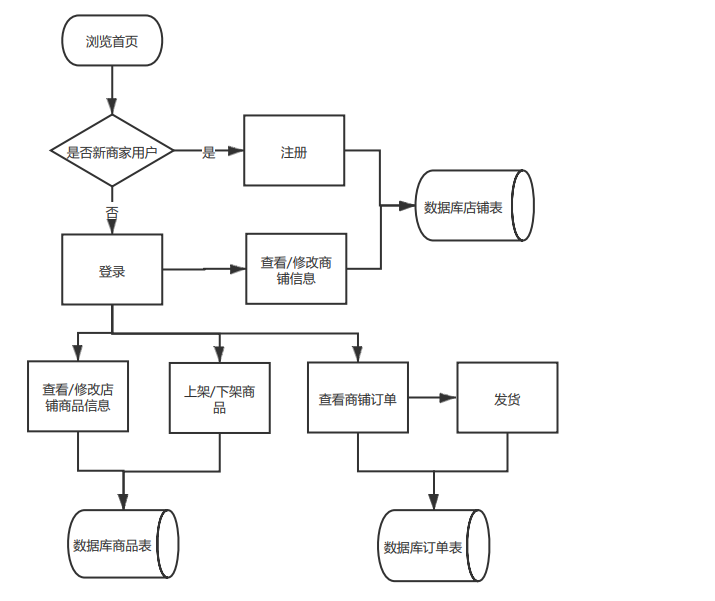

#  
**购物系统**

#  
**产品需求规格说明书**

| 文件状态： | [  ] 草稿  [ √ ] 正式发布  [  ]正在修改 |
| ---------- | --------------------------------------- |
| 当前版本： | 1.0                                     |
| 作   者：  | 宁子淳，樊伟哲，柯俊哲，郑继凯，梁浩    |
| 完成日期： | 2021-待定                               |

版本历史

| 版本状态    | 作者 | 参与者 | 起止日期             | 备注 |
| ----------- | ---- | ------ | -------------------- | ---- |
| 草稿：1.0   |      |        | 2021-3-30——2021-4-15 | 新建 |
| 正式版：1.0 |      |        | 2021-4-15——2021-4-23 | 新建 |

# 目录 

[TOC]

## 文档介绍    

###  文档目的    

本文档主要针对购物系统的使用环境与功能提出具体的要求，同时它还将作为该产品设计与开发的重要参考依据。

###  文档范围    

本文档包含以下几部分：

1.	产品介绍

2.	产品面向的用户群体

3.	产品应当遵循的标准或规范

4.	产品的范围

5.	产品中的角色

4.	产品的功能性需求

5.	产品的非功能性需求

6.	需求确认	

###  读者对象    

本文档的读者范围包括：

1.	需求提供方具体责任人

2.	开发方的项目经理、系统分析设计人员、测试人员

###  参考文档    

《软件工程》(第四版)【美】Shari Lawrence Pfleeger 【加】Joanne M.Atlee 著 杨卫东 译 人民邮电出版社

###  术语与缩写解释    

| **缩写、术语及符号** | **解 释**                                |
| -------------------- | ---------------------------------------- |
| OSS                  | Oline Shopping System的缩写-网上购物系统 |

## 产品介绍    

当下电子商务平台的不断发展，越来越多的人对于网上购物，直播带货等多种多样的买卖方式产生了兴趣，同时各类购物平台不断开发升级自己的购物系统，发展出个人或者企业独立的网上门店，各种各样的平台样式不断出现，但是归结到核心内容底层的开发还是比较相似的。因此本团队致力于打造自己的购物平台，深度了解购物平台底层的建设。

## 产品面向的用户群体    

购物(OSS)主要是团队熟悉购物系统的开发与运行流程的项目，也会和不同项目开发的技术人员探讨，同时还会模拟真实用户的购物和开商铺的体验。

## 产品应当遵循的标准或规范    

本产品的是一套标准的网上购物软件，符合国家财务标准，本产品遵循《计算机软件保护条例》的各项规定。

## 产品范围    

网上购物系统是模拟电商平台开店铺，购物等功能的软件系统。本产品适用于任意有开发网上店铺或者进行网上购物体验的用户。

## 产品中的角色    

| 角色名称   | 拥有功能权限                                                 |
| ---------- | ------------------------------------------------------------ |
| 超级管理员 | 拥有使用系统所有功能的权限，用户私人信息除外。               |
| 商家       | 在拥有相应的权限的情况下，可以维护各种个人信息，店铺信息，商品信息，订单信息 |
| 顾客       | 在拥有相应的权限的情况下，可以维护各种个人信息，订单信息     |

## 产品的功能性需求    

###  功能性需求分类    

| 功能类别     | 功能                   | 描述                                                         |
| ------------ | ---------------------- | ------------------------------------------------------------ |
| 用户登录     | 用户登录               | 对用户输入的用户名，密码进行验证，验证通过后，该用户可以使用购物系统中自己拥有权限的那部分功能，否则拒绝使用。 |
|              |                        |                                                              |
| 店铺资料维护 | 新建，修改，删除，查询 | 商家用户新建，修改，删除或查询店铺数据，系统根据用户的操作，对店铺资料进行更新或显示。 |
| 商品资料维护 | 新建，修改，删除，查询 | 商家用户新建，修改，删除或查询商品数据，系统根据用户的操作，对商品资料进行更新或显示。 |
| 订单资料维护 | 商家修改               | 商家用户查看，部分修改订单数据，系统根据双方用户的操作，对订单资料进行更新或显示。 |
|              |                        |                                                              |
| 购买商品     | 购买                   | 顾客通过查询商品信息完成商品购买                             |
| 订单资料维护 | 顾客新建，查看         | 顾客用户查看，建立订单数据，同行可以查看，进行部分修改，系统根据双方用户的操作，对订单资料进行更新或显示。 |
| 维护用户资料 | 修改，删除，查询       | 拥有系统维护权限的用户可以增加新用户，并可以对用户的资料进行修改、删除以及查询。 |
|              |                        |                                                              |
| 管理用户权限 | 权限                   | 拥有权限管理的用户可以设定其他用户对软件的访问权限。         |
| 修改密码     | 修改                   | 用户重新设定自己的密码                                       |
| 报表导出     | 导出店铺/商品/订单信息 | 将系统中店铺信息/商品资料信息/订单资料信息汇总导出到Excel    |

###  功能图    

###  用例描述    

#### 用户登录    

##### 用例名称

中文名称：用户登录

功能：验证用户的身份。

##### 简要说明

本用例的功能主要是用于确保用户在提供正确的验证信息之后，可以进一步使用本系统。

##### 事件流

1. 基本流
   1) 用户请求使用本系统。
   2) 系统显示用户登录信息输入界面。
   3) 用户输入登录名，密码并确认操作。
   4) 系统验证用户登录信息，如果登录信息验证没有通过，系统显示提醒信息，并转向基本流2，如果验证通过，系统显示系统操作主界面。
2. 备选流
   备选流1：
   1) 客户可以在没有登录成功之前的任意时候要求放弃登录。
   2) 系统结束用户登录信息输入界面的显示。
   3) 退出系统。

##### 特殊需求

无

##### 前置条件

请求使用本系统

##### 后置条件

用户登录成功,可以使用系统提供的功能

##### 附加说明

无

#### 商家    

##### 维护店铺资料

###### 用例名称

中文名称：维护店铺资料

功能：用于维护商家开设的店铺信息资料。

###### 简要说明

本用例的功能主要是新建，增加、删除、修改、查询店铺的信息。

###### 事件流

1. 基本流
   1) 商家用户请求维护店铺资料。
   2) 系统显示店铺信息资料。
   3) 根据用户的操作执行以下相应操作。
        a. 用户修改已经存在的店铺信息，系统执行修改店铺信息子流。
        b. 用户选择增加店铺操作，系统执行增加店铺信息子流。
        c. 用户选择删除店铺操作，系统执行删除店铺信息子流。
        d. 用户选择查询符合指定条件的店铺的信息，系统执行查询店铺子流。
   4) 用户要求保存操作结果。
   5) 系统保存用户操作结果。
   6) 用户要求结束店铺信息的维护。
   7) 系统结束店铺资料的显示。

1. 1 修改店铺子流
   1) 用户修改店铺信息。
   2) 系统验证修改过的信息，如果没有通过验证，系统提醒用户并转向基本流2。
   3) 系统返回基本流4。

1. 2 增加店铺信息子流
   1) 显示新增店铺输入界面。
   2) 用户输入新店铺信息。
   3) 系统验证新输入的信息，如果没有通过验证，系统提醒用户并转向基本流2。
   4) 系统返回基本流4。 

1. 3 删除店铺信息子流
   1) 用户选择要被删除的店铺信息。
   2) 用户请求删除选择的店铺信息。
   3) 系统询问用户是否真的要删除指定店铺的信息。
   4) 根据用户的选择，系统执行相应的操作。
        a. 用户选择继续删除，系统删除该店铺的信息。
        b. 用户选择取消，系统不删除该店铺的信息。
   5) 系统返回基本流4。

1. 4 查询店铺信息子流
   1) 显示指定查询条件界面。
   2) 用户指定查询条件并确认操作。
   3) 系统显示符合条件的店铺。

###### 前置条件

- 进入本系统的主界面。

- 拥有维护店铺信息资料的权限。

###### 后置条件

- 系统保存修改过的店铺资料。

###### 附加说明

- 操作的店铺的资料应包括：店铺编号，中文姓名，英文姓名，电话，移动电话，以及联络地址。

##### 商品资料维护

###### 用例名称

中文名称：维护商品资料

功能：用于维护公司经营的商品的信息资料。

###### 简要说明

本用例的功能主要是增加、删除、修改、查询公司所经营商品的信息资料。

###### 事件流

1. 基本流
   1) 用户请求维护公司商品资料。
   2) 系统显示公司商品信息资料。
   3) 根据用户的操作执行以下相应操作。
        a. 用户修改已经存在的商品的信息，系统执行修改商品信息子流。
        b. 用户选择增加商品信息操作，系统执行增加商品信息子流。
        c. 用户选择删除商品信息操作，系统执行删除商品信息子流。
        d. 用户选择查询符合指定条件的商品的信息，系统执行查询商品信息子流。
   4) 用户要求保存操作结果。
   5) 系统保存用户操作结果。
   6) 用户要求结束公司商品信息的维护。
   7) 系统结束公司商品资料的显示。

1. 1 修改商品信息子流
   1) 用户修改商品信息。
   2) 系统验证修改过的信息，如果没有通过验证，系统提醒用户并转向基本流2。
   3) 系统返回基本流4。

1. 2 增加商品信息子流
   1) 显示新增商品信息输入界面。
   2) 用户输入新商品信息。
   3) 系统验证新输入的信息，如果没有通过验证，系统提醒用户并转向基本流2。
   4) 系统返回基本流4。 

1. 3 删除产品信息子流
   1) 用户选择要被删除的商品信息。
   2) 用户请求删除选择的商品信息。
   3) 根据请求被删除的商品信息情况，执行以下操作。
        a. 如果公司曾经销售过该商品或采购过该商品，提醒这些商品曾经有过交易记录，不允许被删除。转删除产品信息子流1。 
        b. 如果不属于上述情况，则允许删除产品信息，继续执行下一步骤。
   4) 系统询问用户是否真的要删除指定商品的信息。
   5) 根据用户的选择，系统执行相应的操作。
        a. 用户选择继续删除，系统删除该商品的信息。
        b. 用户选择取消，系统不删除该商品的信息。
   6) 系统返回基本流4。

1. 4 查询商品信息子流
   1) 显示指定查询条件界面。
   2) 用户指定查询条件，并确认操作。
   3) 系统显示符合条件的商品信息。

###### 前置条件

- 进入本系统的主界面。

- 拥有维护商品信息资料的权限。

###### 后置条件

- 系统保存修改过的商品资料。

##### 订单资料维护

###### 用例名称

中文名称：维护订单数据

功能：用于维护订单的信息资料。

###### 简要说明

本用例的功能主要是修改、查询订单的信息。

###### 事件流

1. 基本流
   1) 用户请求维护订单资料。
   2) 系统显示订单信息资料。
   3) 根据用户的操作执行以下相应操作。
        a. 用户修改已经存在的订单信息，系统执行修改订单信息子流。
        b. 用户选择查询符合指定条件的订单的信息，系统执行查询订单子流。
   4) 用户要求保存操作结果。
   5) 系统保存用户操作结果。
   6) 用户要求结束订单信息的维护。
   7) 系统结束订单信息的显示。

1. 1 修改订单信息子流
   1)用户修改订单信息。
   2) 系统验证修改过的信息，如果没有通过验证，系统提醒用户并转基本流2。
   3) 系统返回基本流4。

1. 2 查询订单信息子流
   1) 显示指定查询条件界面。
   2) 用户指定查询条件，并确认操作。
   3) 系统显示符合条件的订单信息。

###### 前置条件

- 进入本系统的主界面。

- 拥有维护订单信息资料的权限。

###### 后置条件

- 系统保存修改过的订单信息资料。

####  顾客

##### 购买商品  

###### 用例名称

中文名称：购买商品

功能：用于维护顾客购买商品信息。

###### 简要说明

本用例的功能主要是购买商品。

###### 事件流

1. 基本流
   1) 用户请求维护购买商品资料。
   2) 系统显示商品购买信息。
   3) 根据用户的操作执行以下相应操作。
        a. 用户使用关键字完成对商品的购买
   4) 用户要求保存操作结果。
   5) 用户要求结束商品购买数据的维护。
   6) 系统结束商品购买数据的显示。

###### 前置条件

- 进入本系统的主界面。

- 拥有维护采购入库单据资料的权限。

###### 后置条件

- 系统保存修改过的采购入库单据信息。

###### 附加说明

- 被操作采购入库单内容包括：供应商编号，供应商名称，采购单单号，采购日期，总金额以及商品明细，其中商品明细包括商品编号，商品数量，单价及金额。

#### 系统维护

##### 用户资料维护

###### 用例名称

中文名称：维护用户资料 

功能：用于维护使用本系统的用户资料。

###### 简要说明

本用例的功能主要是增加、禁用、修改、查询系统的用户资料。

###### 事件流

1. 基本流
   1) 用户请求维护系统用户的资料。
   2) 系统显示该系统所有用户的资料。
   3) 根据用户的操作，执行相应操作。
        a. 用户修改某个已经存在用户的资料，系统执行修改用户资料子流。
        b. 用户请求增加一个新用户，系统执行增加新用户子流。
        c. 用户请求禁用某个用户，系统执行禁用用户子流。
        d. 用户请求查询符合指定条件的用户，系统执行查询用户子流。
   4) 用户要求保存操作结果。
   5) 系统保存用户的操作结果。
   6) 用户要求结束维护系统用户资料。
   7) 系统结束维护用户资料界面。

1. 1 修改用户资料子流
   1)用户修改用户信息。
   2) 系统验证修改过的信息，如果没有通过验证，系统提醒用户并转向修改用户资料子流1。
   3) 系统返回基本流4。

1. 2 增加用户子流
   1) 显示新增用户信息输入界面。
   2) 用户输入新用户信息。
   3) 系统验证新用户的信息，如果没有通过验证，系统提醒用户并转向增加用户子流2。
   4) 系统返回基本流4。 

1. 3 禁用用户子流
   1) 用户选择要被禁用的用户信息。
   2) 用户请求禁用选择的用户。
   3) 系统询问用户是否真的要禁用指定用户。
   4) 根据用户的选择，系统执行相应的操作。
   	a. 用户选择禁用，系统禁用该用户。
   	b. 用户选择不禁用，系统不禁用该用户。
   5) 系统返回基本流4。

1.  4 查询用户信息子流
   1) 显示指定查询条件界面。
   2) 用户指定查询条件，并确认操作。
   3) 系统显示符合条件的员工信息。

2. 备选流
   a) 备选流1：
       1) 如果在用户请求保存操作结果的时候，由于网络、数据库管理系统等外部原因造成操作结果不能保存，系统保证以恰当的方式通知用户，并维护用户的操作状态，在外部原因消除之后，用户仍能继续操作。
   b) 备选流2：
       1) 如果用户要求结束用户资料信息维护的时候，仍有未保存的信息，系统提醒用户。
       2) 根据用户的选择执行以下操作。
   	    a. 用户选择保存信息，系统保存信息，继续执行基本流7。
   	    b. 用户选择不保存信息，系统执行基本流7。
   	    c. 用户选择取消操作，系统执行基本流3。

###### 特殊需求

- 用户编号必须指定，输入用户编号不得超过8个字符。

- 输入用户真实姓名不能超过30个字符。

- 用户初始密码必须指定，输入用户初始密码必须在6－30个字符之间。

- 系统设置超级管理员一个，该用户在系统显示维护用户资料界面不能显示，该用户的密码只能由该用户修改，该用户的其它资料不允许修改。

- 用户在修改资料时，不得修改用户编号。

- 添加用户时，密码应采用MD5加密，然后存储。

###### 前置条件

- 进入本系统的主界面。

- 拥有维护用户资料的权限。

###### 后置条件

- 系统保存用户维护后的用户资料。

###### 附加说明

- 用户资料包括用户编号、用户真实姓名、用户密码。

##### 管理用户权限  

###### 用例名称

中文名称：管理用户权限 

功能：用于维护系统用户操作系统的权限。

###### 简要说明

本用例的功能主要是增加、删除用户对程序各个模块的使用权限。

###### 事件流

1. 基本流
   1) 用户请求管理系统用户的权限。
   2) 系统显示系统用户的权限。
   3) 用户选择一个系统用户。
   4) 系统显示该用户现有的模块权限，以及可供增加的其它模块权限。
   5) 用户修改该用户的模块权限。
   6) 用户要求保存操作结果。
   7) 系统保存用户操作的结果。
   8) 用户要求结束用户权限的维护。
   9) 系统结束用户权限维护。
2. 备选流
   a) 备选流1：
   1) 如果在用户请求保存操作结果的时候，由于网络、数据库管理系统等外部原因造成操作结果不能保存，系统保证以恰当的方式通知用户，并维护用户的操作状态，在外部原因消除之后，用户仍能继续操作。
   b) 备选流2：
   1) 如果用户要求结束用户权限维护的时候，仍有未保存的信息，系统提醒用户。
   2) 根据用户的选择执行以下操作。
       a. 用户选择保存信息，系统保存信息，继续执行基本流7。
       b. 用户选择不保存信息，系统执行基本流7。
       c. 用户选择取消操作，系统执行基本流5。  

###### 特殊需求

- 超级管理员不应该在管理用户界面上显示。

- 用户权限的分配让用户选择，而不要用户填写模块编号或名称。

###### 前置条件

- 进入本系统的主界面。
- 拥有管理系统使用用户权限的权限。

###### 后置条件

- 系统保存修改过的用户权限。

###### 附加说明

- 每个模块的操作为一个权限。

##### 修改密码  

###### 用例名称

中文名称：修改用户密码 

功能：用于系统用户修改自己的密码，以确保系统的安全性。

###### 简要说明

本用例的功能主要是允许用户修改自己的密码。

###### 事件流

1. 基本流
   1) 用户请求修改自己的密码。
   2) 系统显示密码修改界面。
   3) 用户输入旧密码、新密码。
   4) 系统对旧密码进行验证，再次要求用户输入新密码的确认密码。
   5) 用户输入新密码确认密码。
   6) 系统比较新密码和新密码确认密码，根据比较结果执行下面的相应操作。
       a. 新密码和新密码确认密码相符，继续执行下一步骤。
       b. 新密码和新密码确认密码不相符，返回基本流3。
   7) 系统修改用户密码，并提醒用户密码修改已成功。
   8) 用户要求结束用户密码修改任务。
   9) 系统结束用户密码修改界面的显示。

2. 备选流
   a) 备选流1
       1) 如果在用户请求保存操作结果的时候，由于网络、数据库管理系统等外部原因造成操作结果不能保存，系统保证以恰当的方式通知用户，并维护用户的操作状态，在外部原因消除之后，用户仍能继续操作。
       2) 用户在基本流7之前的任意一个步骤可以放弃密码的修改。

###### 特殊需求

- 超级管理员的密码允许被自己修改。

- 用户新密码必须指定，不能为空，输入字符在6－30个字符之间。

###### 前置条件

- 进入本系统的主界面。

###### 后置条件

- 系统成功保存用户的新密码，新密码下次登录生效。

###### 附加信息

​	无

#### 导出报表

##### 导出店铺信息

###### 用例名称

中文名称：导出店铺信息报表到Excel 

功能：用于导出店铺信息报表到Excel。

###### 简要说明

本用例的功能主要是导出当前店铺信息，便于管理。

###### 事件流

1. 基本流
   1) 管理员导出店铺信息报表。
   2) 系统显示导出店铺信息报表操作界面。
   3) 管理员选择导出，系统将店铺信息报表导入Excel文件。
   4) 用户请求关闭打印店铺信息报表操作界面。
   5) 系统关闭导出店铺信息报表操作界面。
2. 备选流
   a) 备选流1：
       1) 如果在用户请求导出的时候，系统所在的机器上没有安装Excel，系统保证以恰当的方式通知用户，并维护用户的操作状态，在外部原因消除之后，用户仍能继续操作。

###### 特殊需求

无

###### 前置条件

- 进入本系统的主界面。

- 拥有导出库存报警报表权限。

###### 后置条件

- 系统完成库存报警报表的导出。

###### 附加条件

- Excel报表默认显示以下列
  商品编号、商品名称、安全库存、当前库存。

##### 导出商品资料  

###### 用例名称

中文名称：导出商品资料报表 

功能：用于将商品资料报表导出到Excel。

###### 简要说明

本用例的功能主要是根据用户指定的查询条件以Excel形式显示商品信息。

###### 事件流

1. 基本流
   1) 用户请求导出商品资料表。
   2) 系统显示导出商品资料表操作界面。
   3) 根据用户的选择，执行相应操作。
   	a. 用户选择查询，系统执行查询子流。
       b. 用户选择导出到Excel，系统执行导出子流。
   4) 用户请求关闭导出商品资料操作界面。
   5) 系统关闭导出商品资料表操作界面。

1. 1 查询子流
   1) 系统显示查询界面。
   2) 用户指定查询条件并确认。
   3) 根据用户的选择，系统执行相应的操作。
       a. 用户选择了确定，系统关闭查询界面，系统显示符合查询条件的商品。
       b. 用户选择了取消，系统关闭查询界面。
   4) 返回基本流3。

1.  2 导出子流
   1) 系统将商品资料导出到Excel。
   2) 返回基本流3。  

2. 备选流
   a) 备选流1：
       1) 如果在用户请求打印的时候，系统所在的机器上没有安装Excel，系统保证以恰当的方式通知用户，并维护用户的操作状态，在外部原因消除之后，用户仍能继续操作。

###### 特殊需求

无

###### 前置条件

- 进入本系统的主界面。

- 拥有导出商品资料表权限。

###### 后置条件

- 系统完成商品资料表导出到Excel。

###### 附加条件

- Excel中默认显示以下列
  商品编号、商品名称、指导进价、指导售价、安全库存、当前库存、最近销售日期、最近采购日期。

##### 导出订单报表

###### 用例名称

中文名称：导出订单汇总报表 

功能：用于导出订单汇总报表到Excel。

###### 简要说明

本用例的功能主要是根据用户指定的条件导出采购汇总报表到Excel。

###### 事件流

1. 基本流
   1) 用户请求导出订单汇总报表。
   2) 系统显示导出订单汇总报表操作界面。
   3) 根据用户的选择，执行相应操作。
       a. 用户选择指定汇总开始日期和截止日期，系统执行指定汇总日期子流。
       b. 用户选择指定汇总条件，系统执行指定汇总条件子流。
       c. 用户选择导出，系统执行导出子流。
   4) 用户请求关闭导出订单汇总报表操作界面。
   5) 系统关闭导出订单汇总报表操作界面。

1. 1 指定汇总日期子流
   1) 用户指定汇总开始日期和结束日期。
   2) 系统显示开始日期和结束期之间的采购汇总信息。
   3) 返回基本流3。

1.  2 打印子流
   1) 使用设置报表通用属性子用例完成打印。
   2) 返回基本流3。  

2. 备选流
   a) 备选流1：
       1) 如果在用户请求导出的时候，系统所在的机器上没有安装Excel，系统保证以恰当的方式通知用户，并维护用户的操作状态，在外部原因消除之后，用户仍能继续操作。

###### 特殊需求

无

###### 前置条件

- 进入本系统的主界面。

- 拥有导出采购汇总报表的权限。

###### 后置条件

- 系统完成采购汇总报表的导出。

###### 附加条件

无

## 产品的非功能性需求    

### 用户界面需求    

| 需求名称       | 详细要求                                   |
| -------------- | ------------------------------------------ |
| 母窗体显示位置 | 窗体初次启动时在屏幕位置居中，窗体最大化。 |
| 子窗体显示位置 | 窗体初次启动时在母窗体居中。               |
| 界面风格       | 界面为 “简约”观感。                        |
| 界面字体颜色   | 自行设计                                   |

### 软硬件环境需求    

| 需求名称 | 详细要求                                                     |
| -------- | ------------------------------------------------------------ |
| 硬件要求 | IBM兼容机、Intel Pentium III 800/AMD K7以上处理器、128M以上内存，支持标准网络协议的网卡 |
| 系统平台 | Windows10                                                    |

### 产品质量需求    

| 主要质量属性 | 详细要求                                                     |
| ------------ | ------------------------------------------------------------ |
| 正确性       | 业务错误不允许出现                                           |
| 健壮性       | 能够容纳300人同时访问，服务器端程序应连续工作半年以上        |
| 可靠性       | 除电源、硬件、操作系统、服务器管理系统外程序不允许异常退出或崩溃。 |
| 性能，效率   | 系统处理业务时间最迟时间小于等于5秒                          |
| 易用性       | 不用安装，操作简便                                           |
| 清晰性       | 业务流程明确                                                 |
| 安全性       | 用户信息保密，操作权限明确                                   |
| 可扩展性     | 可在当前需求基础之上进行功能上的扩展                         |
| 兼容性       | 可运行在大多数主流的硬件环境中                               |
| 可移植性     | 可运行在大多数主流的操作平台上                               |

 

 